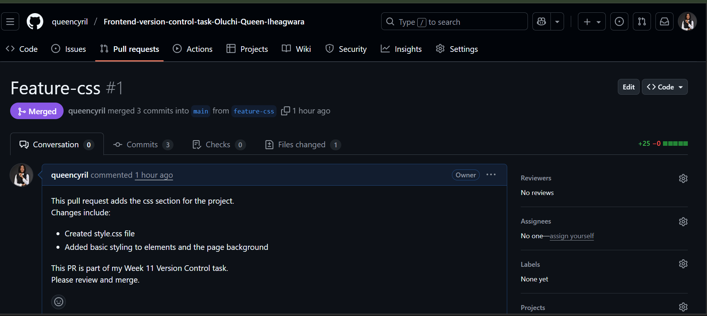

# Frontend Version Control Task – Oluchi Iheagwara

This repository contains my version control practice work for the Flexisaf internship program.

## Branches and Purpose
- **feature-html**: Created a simple html page.
- **feature-css**: Created a css file and styled my html elements with it.

## Pull Requests
Screenshots: Here is a screenshot of my project-  

## Common Git Commands I Used
- git init
- git add .
- git commit -m ""
- git push
- git pull
- git checkout -b branchname
- git checkout branchname
- git revert hash
- git branch -m oldname newname
- git fetch

## Lessons Learned
- How to create repository
- How to clone repo on local development environment
- How to commit 
-How to push 
- How to manage branches properly  
- How pull requests and code reviews work  
- How to revert a commit  
- How to rename and merge branches
- How to merge Pull request 

